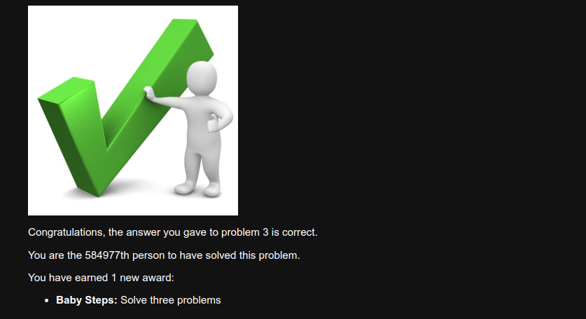

# Desafios Gerais

## Problemas Resolvidos

### 1. Multiples of 3 or 5
- **Resposta**: 233168
- **Descrição**: Soma de todos os múltiplos de 3 ou 5 abaixo de 1000.
- **Código**: [`src/MultiplesOf3Or5.java`](src/MultiplesOf3Or5.java)
- **Print de confirmação**:
  

### 2. Even Fibonacci Numbers
- **Resposta**: 4613732
- **Descrição**: Soma de todos os números pares na sequência de Fibonacci abaixo de 4 milhões.
- **Código**: [`src/EvenFibonacciNumbers.java`](src/EvenFibonacciNumbers.java)
- **Print de confirmação**:
  

### 3. Largest Prime Factor
- **Resposta**: 6857
- **Descrição**: Maior fator primo de 600851475143.
- **Código**: [`src/LargestPrimeFactor.java`](src/LargestPrimeFactor.java)
- **Print de confirmação**:
  
